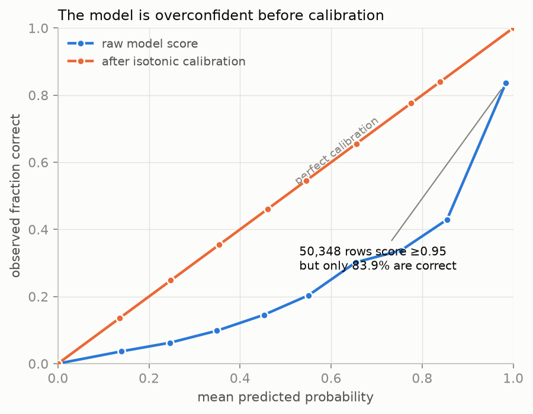
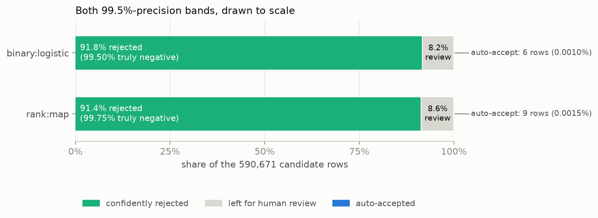
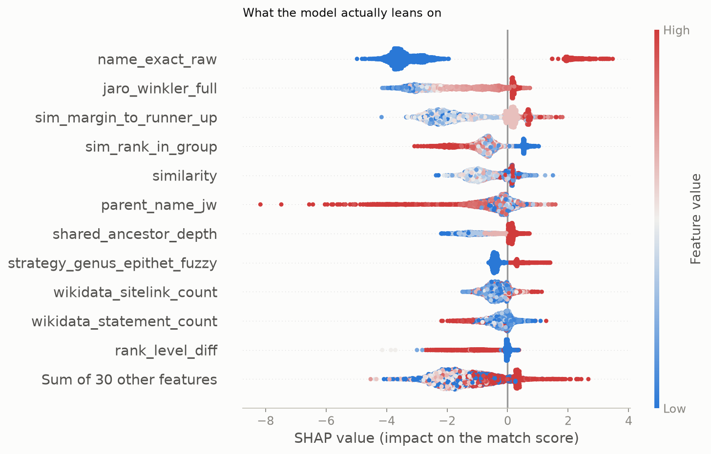

# xgboost-inat-wikidata-match

[](https://github.com/Livia-Rasp/xgboost-inat-wikidata-match/actions/workflows/ci.yml)
[](LICENSE)

A record-linkage classifier ([XGBoost](https://xgboost.readthedocs.io/en/stable/)) that decides
which iNaturalist taxon a Wikidata taxon item refers to, when the name alone is ambiguous.

[wikidata-inat-checker](https://github.com/Livia-Rasp/wikidata-inat-checker) scans Wikidata taxa
against iNaturalist's open-data taxon dump and writes everything it cannot resolve on a unique
name match to a human review queue. One scan of 80,000 names produces 491 such items. On a
hand-labelled sample of 263 of them, this model ranks the correct iNat taxon first **98.7%** of
the time, against **21.3%** for the exact-name-match rule the queue currently relies on. That
turns a queue item from "search iNaturalist and compare ancestries" into "confirm or reject one
suggestion".

> Built with [Claude Code](https://claude.com/claude-code) as a pair programmer; `CLAUDE.md` is
> the working log kept for it. The project design, the label-noise hypothesis, the gold-set
> methodology, and every hand-label in `gold/` are mine.

## Results

| | Answers without a human¹ | Precision of those answers | Top-1 accuracy² | MRR |
|---|---|---|---|---|
| Exact-match baseline (OOF) | 86.7% | 80.7% | 81.6% | — |
| **`rank:map` (OOF)** | 0.002% | 100% | 99.0% | 0.994 |
| `binary:logistic` (OOF) | 0.001% | 100% | **99.1%** | 0.995 |
| Exact-match baseline (gold) | 100% | 21.3% | 21.3% | — |
| **`rank:map` (gold)** | none³ | — | **98.7%** | **0.993** |
| `binary:logistic` (gold) | none³ | — | **98.7%** | 0.993 |

¹ Different units, same question: how often can this run unsupervised, and how often is it right
when it does. For the baseline it is the share of items where an exact name match exists at all;
for the models, the share of candidate rows clearing a threshold chosen for ≥99.5% precision. The
baseline answers far more often and is wrong a fifth of the time.
² Was the correct candidate ranked first. For the baseline this counts a correct abstention as
correct too, so it is not deflated by items with no answer.
³ No gold row clears the OOF-chosen auto-accept threshold. This is a real result and it is
discussed in [Limitations](#limitations), not a missing measurement.

The two objectives are separated by one metric and a large operational difference. Gold top-1 is
**identical** (both 98.70% — three misses each of 230 answerable items, two of them the same
items); `rank:map` wins on gold Brier (0.0083 against 0.0100) and MRR, and far more usefully, its
reject threshold is the only one that
survives the population change — see [Limitations](#limitations). `docs/findings.md` §6 previously
picked `binary:logistic` partly because it was "the only variant clearing the 99.5% auto-accept
bar"; on the current models both clear it, so that argument no longer applies.

**OOF** is 5-fold out-of-fold cross-validation over 590,671 candidate rows for 58,842 Wikidata
items, grouped on family so no item's rows span two folds. **Gold** is 263 ambiguous Wikidata
items with no P3151 statement, hand-labelled for this project — a population no bot has ever
touched, and disjoint from everything the model trained on. Candidate generation finds the
correct taxon for **100%** of the gold items that have one, so nothing above is capped by recall.

<picture>
  <source media="(prefers-color-scheme: dark)" srcset="docs/img/calibration-dark.png">
  
</picture>

## The label-noise finding

Isotonic calibration surfaced something the accuracy numbers hide. 50,348 candidate rows score
≥0.95 on the raw model probability, but only **83.9%** of them are correct, which is why the
strict 99.5%-precision auto-accept band covers just 6 rows out of 590,671. Inside that
overconfident cluster, correct and incorrect rows are statistically indistinguishable on every
engineered feature, and it is almost never a genuine tie between two candidates. That pattern
does not look like a weak model; it looks like wrong labels. Training labels come from Wikidata's
P3151 statements, most of them added in bulk by bots, so the hypothesis was that the model was
being marked wrong for getting the answer right.

Testing that needed labels P3151 never touched, which is the reason the gold set exists at all.
On the gold set, the same raw-score band reads **98.3%** precision instead of 83.9%. The ceiling
was in the labels.

This is the most stable result in the project. It has now been measured against five separately
trained model versions — the frozen originals and four ladder rungs (`docs/findings.md` §10) —
and the gold-side band precision has stayed between 96.9% and 98.3% throughout, against an
OOF-side 83.9% that barely moves at all.

Full working, including the checks that ruled out a feature gap and a tie-breaking gap, is in
[`docs/findings.md`](docs/findings.md).

<picture>
  <source media="(prefers-color-scheme: dark)" srcset="docs/img/threshold-bands-dark.png">
  
</picture>

## How it is evaluated

Three things make these numbers mean what they say:

- **Negatives come from the deployment distribution.** A negative here is another candidate that
  survived generation for the same Wikidata item, not a taxon drawn at random from the 1.4M-row
  index. Random negatives are trivially separable and would have inflated every number in the
  table. This is why the baseline scores 21.3% on gold rather than something respectable.
- **The metric is a decision under asymmetric cost.** A wrong write to Wikidata is much worse
  than a deferral to a human, so thresholds target 99.5% precision and the honest answer is
  sometimes "this system should not act unsupervised". Not AUC.
- **The label noise is quantified, not assumed away.** See above.

<picture>
  <source media="(prefers-color-scheme: dark)" srcset="docs/img/shap-summary-dark.png">
  
</picture>

## Milestones

Spec §7's checkable list. Every "key number" below is reproduced by the command in
[Reproducing this](#reproducing-this).

| # | What it does | Key number | |
|---|---|---|---|
| 1 | Normalised-name + FTS5 trigram index over the local iNat taxa dump, read-only | 1,413,946 taxa indexed | done |
| 2 | Batched SPARQL pull of Wikidata taxa carrying P3151 | 58,874 items | done |
| 3 | Candidate generation, five strategies, K=20 | recall 99.84% of resolvable items | done |
| 4 | Features + `GroupKFold` on family | 590,671 rows × 52 features, no QID in two folds | done |
| 5 | Exact-match baseline, tie-broken by observation count | 81.2% accuracy | done |
| 6 | Two objectives, isotonic calibration, threshold selection | 99.1% top-1 OOF | done |
| 7 | Hand-labelled gold set of ambiguous, no-P3151 items | 98.7% top-1, n=263 | done |
| 8 | Fix the alphabetic bias in the gold sample | A–Z coverage, 491 items found | done |
| 9 | Per-miss review, and picking between the two objectives | `binary:logistic` picked | done |
| 10–12 | QuickStatements export, loop back into the Node tool | — | [future work](docs/future-work.md) |
| 13 | Container, lockfile, one command per stage | gold numbers reproduce from a clean clone | done |
| 14 | Feature construction moved into dbt-core over DuckDB | 46 of 52 columns identical, 103 dbt tests green | done |
| 15 | MLflow tracking + registry; the freeze released and retrained | 5 registered versions, champion resolves to the published numbers | done |
| 16 | Airflow + Terraform: four asset-driven DAGs, promotion gated on the champion | ingest → features → train → gate runs unattended; stack applies from nothing | done |

Milestones 1–12 build the model. 13–16 are platform work — a container, a SQL transformation
layer, experiment tracking and an orchestrated DAG — and are not intended to make the model
better; see spec §7 for what each one has to demonstrate.

The reasoning behind milestones 6, 7 and 9 is in [`docs/findings.md`](docs/findings.md), along
with [what moved when the features were rebuilt in SQL](docs/findings.md#9-rebuilding-the-features-in-sql-what-moved-and-why)
and why each column that differs differs; the full
per-milestone breakdowns and plots are in
[`notebooks/01-report.ipynb`](notebooks/01-report.ipynb).

## Limitations

Stated plainly, because a reviewer who finds an undisclosed limitation should discount the rest
of the numbers.

- **Neither model can act unsupervised at the precision bar this task needs.** At ≥99.5%
  precision the auto-accept band covers 9 of 590,671 OOF rows for `rank:map` (6 for
  `binary:logistic`) and zero gold rows. The system ranks well; it does not yet decide.
- **The reject threshold transfers for one objective and not the other**, which is most of why
  `rank:map` is the reported default. Re-applied unchanged to the gold set, `rank:map` rules out
  33 of 263 items at 99.79% row precision and hides the true match for **5**; `binary:logistic`
  rules out 131 and hides the true match for **98**, which is unusable. Until milestone 15 only
  the `binary` figure was published, and `docs/findings.md` §2 reported the negative result as if
  it were a property of the task rather than of that objective.
- **The gold set is 263 items, and the noise floor on it is about one item.** Milestone 15's v2
  rung changes no feature definition at all — only the order rows are written in — and still
  moves `rank:map`'s top-1 by a full item, and moves which rows fall in the auto-accept band
  (`docs/findings.md` §10). Any difference here smaller than roughly two items should be read as
  noise, including the two objectives' identical 98.70% top-1. 620 sampled items remain
  unlabelled, and labelling them is the single highest-value thing left.
- **The default objective loses a hemihomonym.** `rank:map` ranks an animal genus above the
  correct plant subgenus for *Afrocrania*, because `rank_equal` points one way and every
  taxonomic feature the other. Cross-kingdom matching is a category error rather than a near
  miss, and hemihomonyms are the case this project exists for; `binary:logistic` gets this one
  right. Tracked in [future work](docs/future-work.md).
- **Training labels are noisy.** Quantified above, not eliminated. Every OOF number in this repo
  inherits it.
- **12.85% of P3151 links are stale**, pointing at iNat taxon IDs that no longer exist as active
  taxa. They are unreachable by any candidate strategy, so the raw recall ceiling reads 87.0%
  against 99.84% among resolvable items. Both numbers are reported everywhere rather than the
  flattering one.
- **Two of the three remaining gold misses are iNat-side duplicate records**, not ranking
  failures. The headroom left on this sample is mostly not in the model.

## Reproducing this

### The five-minute path

Runs the gold-set evaluation end to end against committed fixtures. No Node, no 189 MB download,
no network — CI enforces that last one by running this same command with `--network none`.

```sh
git clone https://github.com/Livia-Rasp/xgboost-inat-wikidata-match.git
cd xgboost-inat-wikidata-match
docker compose run --rm pipeline make gold
```

Or without Docker, if you would rather use a local Python 3.12+:

```sh
python3 -m venv .venv && .venv/bin/pip install -e ".[dev]"
.venv/bin/python -m src.evaluate --gold
```

This reproduces the gold rows of the results table, the label-noise band comparison, and the
per-miss breakdown. It works because `gold/hard_cases.csv`, the two small Wikidata pulls for
those items, the slice of the iNat index they touch, and the frozen models are all committed.
Everything else in `data/` is gitignored and rebuilt by the full path below.

### The full path

Needs `~/.cache/wikidata-inat-checker/taxa.db`, which this repo reads read-only and never builds.
Produced by running any checker in the sibling repo:

```sh
git clone https://github.com/Livia-Rasp/wikidata-inat-checker.git
cd wikidata-inat-checker && npm install    # Node.js 26+
npm run links                              # downloads ~189 MB, builds a ~236 MB index, once
```

Then, from this repo, in order — `make all` runs exactly this sequence:

```sh
make wikidata      # milestone 2: batched SPARQL, ~30 requests, cached
make candidates    # milestones 1+3: builds the lookup cache, generates candidates
make ancestors     # milestone 4's input: transitive P171 chains (~8 min, network)
make features      # milestone 4: features and GroupKFold splits
make baseline      # milestone 5: the exact-match rule, per fold and overall
make train         # milestone 6: both objectives, 5-fold OOF, thresholds
make final-models  # refits both variants on all folds into data/models/
make figures       # regenerates docs/img/ from the caches above
```

Milestone 14 rebuilds the same feature table in SQL, beside the pandas one rather than over it,
and diffs the two:

```sh
make features-sql  # dbt build: 15 models, 103 tests -> data/features_dbt.parquet
make parity        # the column-by-column comparison behind docs/findings.md §9
```

In a container, with the sibling repo's index mounted read-only:

```sh
docker compose run --rm pipeline-full make all
```

Every step caches to `data/` with a manifest and is a no-op on rerun unless its inputs change —
keyed on content, so copying a cache between machines or into an image does not invalidate it.
Total first-run cost is roughly 15 minutes, most of it waiting on Wikidata Query Service. The
exact flags, cache-invalidation rules, and the failure modes worth knowing about are documented
per milestone in [`CLAUDE.md`](CLAUDE.md); `make help` lists every target.

Paths are configurable for the container's sake and default to the layout above:
`MATCHER_DATA_DIR`, `MATCHER_TAXA_DB`, `MATCHER_MODEL_DIR`, `MATCHER_SIBLING_REPO`, and
`MATCHER_WORKERS` to cap the candidate-generation pool (neither `os.cpu_count()` nor
`os.process_cpu_count()` can see a `--cpus` quota).

The gold-set workflow — generate a fresh ambiguous sample, hand-label it, score it — is in
[`gold/README.md`](gold/README.md).

### The orchestrated path

The same stages run as four Airflow DAGs on a Terraform-provisioned stack (Airflow, MLflow,
Postgres, MinIO), described in [`docs/platform.md`](docs/platform.md):

```sh
make platform-up        # terraform apply; prints the MLflow and Airflow URLs
```

Ingest is triggered by hand — the Wikidata cache has no staleness check, so a schedule would
either do nothing or force a re-pull that changes the training population. Everything after it is
asset-driven, and an asset event is emitted only when an artefact's *content* changed, so
rebuilding identical features does not retrain. `train_and_evaluate` ends at a gate that applies
[`docs/findings.md`](docs/findings.md) §10's pre-registered rule: a challenger that wins is
promoted and exported, one that is merely not better is held under a `challenger` alias, and only
a real regression fails the run. A gate that can decline to promote is the thing a DAG has and a
shell script does not — the first unattended run through it retrained the champion's own code and
correctly held.

A fourth DAG, `score_ambiguous`, ranks the checker's open ambiguous findings with the registered
champion, read-only. It writes a ranking and no accept/reject decision, for the reason in
[Limitations](#limitations).

### Tests

```sh
make test    # pytest against committed fixtures, no network
make lint    # ruff check .
```

Or `docker compose run --rm pipeline make test lint` to run them the way CI does.

## Design

- [`docs/inat-wikidata-match-spec.md`](docs/inat-wikidata-match-spec.md) — the full spec: repo
  shape, normalisation rules, candidate strategies, feature set, model config, milestones.
- [`docs/motivation.md`](docs/motivation.md) — why ambiguous P3151 links matter, and what a
  wrong one looks like on a live iNaturalist page.
- [`docs/findings.md`](docs/findings.md) — the calibration investigation, the threshold-transfer
  result, every gold-set miss characterised, and why `binary:logistic` won.
- [`docs/platform-design.md`](docs/platform-design.md) — the design for milestones 13–16: tool
  versions and why, an audit of the existing pipeline, and the alternatives that were rejected.
- [`docs/future-work.md`](docs/future-work.md) — what is deliberately not done yet.

The models live in an MLflow registry, and `data/models/` is an export of whichever version holds
the `@champion` alias — kept committed so the five-minute path and CI still work with no server.
Every number above resolves to a logged metric on a named run, and the alias resolves to the model
those numbers came from; that is milestone 15's acceptance check.

Until milestone 15 this was a paragraph rather than a mechanism: the models were frozen by
convention, and `train.build_final_models()` simply declined to overwrite them. Milestone 15
released that freeze deliberately and retrained as a ladder of five versions, one change per rung,
so each delta is attributable — including a rung that changes no feature definition at all and
exists only to measure how much a pure row-order reshuffle is worth. The full comparison, the
pre-registered decision rule, and the two places it produced an uncomfortable answer are in
[`docs/findings.md`](docs/findings.md) §10.

## Licence

[MIT](LICENSE).
